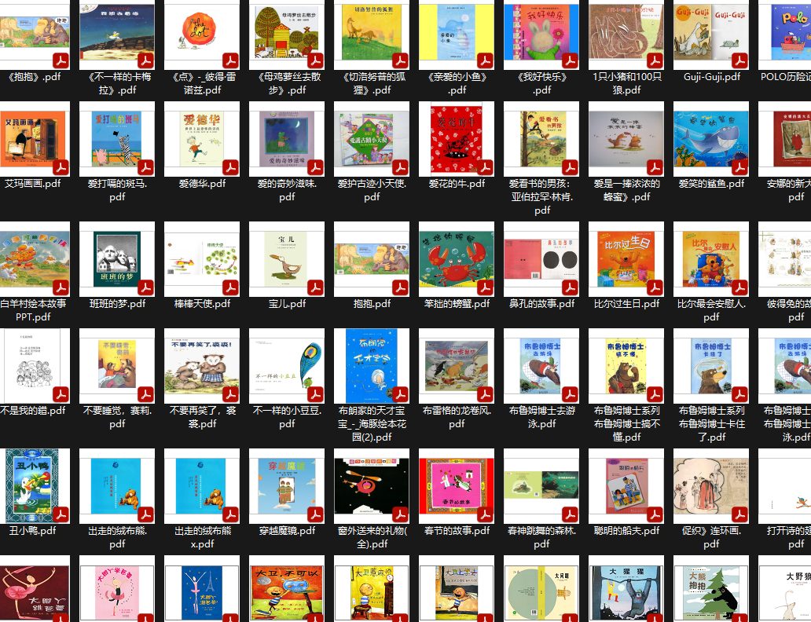

### 项目说明
> winxos 20230907

网上很多绘本和资料都是ppt等相关格式的，平板等阅读和管理不方便，

这个代码可以将ppt,pptx,pps格式转化为pdf文件格式，

便于资料管理和阅读。

代码利用powerpoint 软件功能完成相关转换，

所以代码需要运行在安装有PowerPoint软件的windows系统上，

python 需要安装pypdf等库，如遇到缺失库，请自行pip安装。

测试通过环境是：python3.9+windows11

  
原始大量pps等格式文件

 
转换后的pdf文件
 
